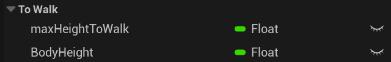

# Процедурная анимация для китайского дракона
Данный исходный код разработан в рамках выпускной квалификационной работы (ВКР). В проекте реализована процедурная анимация в режиме реального времени волнообразного движения четырехлапого китайского дракона воздухе и на земле с учетом особенностей рельефа. Ссылка на текст ВКР – [\[ВКР\]](https://drive.google.com/drive/folders/13zb9z0fob5AFsP5zMjI1rW4lDb6NVeOf?usp=sharing).

# Как запустить
Для запуска необходимо проделать следующие действия:
1. Скачать и установить игровой движок Unreal Engine версии 5.3 или выше;

2. Скачать код из репозитория;

3. Открыть папку, которую Вы скачали и запустить файл «Dragon.uproject»;

4. Дождаться компиляции проекта.

Для запуска прототипа в окне редактора необходимо нажать на зеленую кнопку «Play». На рисунке ниже показано положение кнопки.

# Пример анимации

# Управление
+ W – двигаться вперед
+ A – двигаться влево
+ D – двигаться вправо
+ Левый Ctrl – опускаться вниз (в полете)
+ Левый Shift – подниматься вверх (в полете)
+ Пробел – Смена состояния (Полет/Передвижение по твердой поверхности)

# Параметры анимации
### **Анимация полета**
Для анимации полета используются две волны: горизонтальная и вертикальная. Высоту и длину каждой волны можно поменять в классе BP_Dragon. Параметры указаны на рисунке ниже. Где HeightHor – высота горизонтальной волны, WeightHor – длина горизонтальной волны, HeightVer – высота вертикальной волны и WeightHor – длина вертикальной волны.

### **Анимация передвижения по твердой поверхности**
Во время полета, если нажать на пробел, дракон начнет снижаться и перейдет в состояние передвижения по твердой поверхности. Параметр максимальной высоты до твердой поверхности (maxHeightToWalk), при которой дракон начнет снижение и параметр высоты над твердой поверхностью (BodyHeight) можно изменить в BP_Dragon, параметры указаны на рисунке ниже.

### **Общие параметры**
Также в классе BP_Dragon можно изменить скорость перемещения дракона (maxSpeed), скорость поворота в стороны (angleRight).

